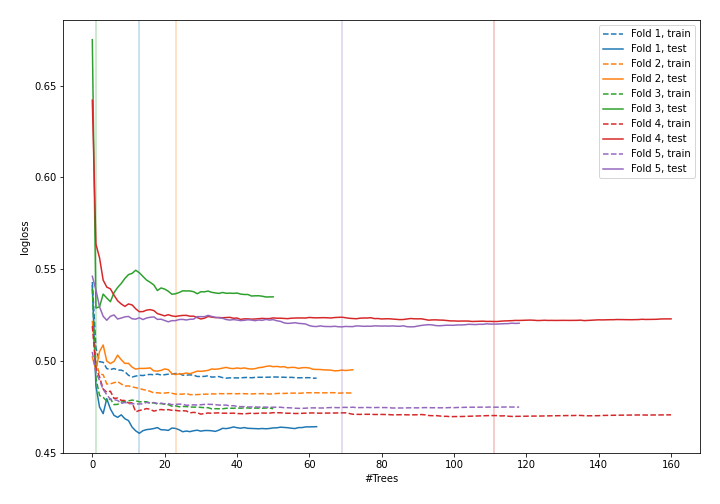
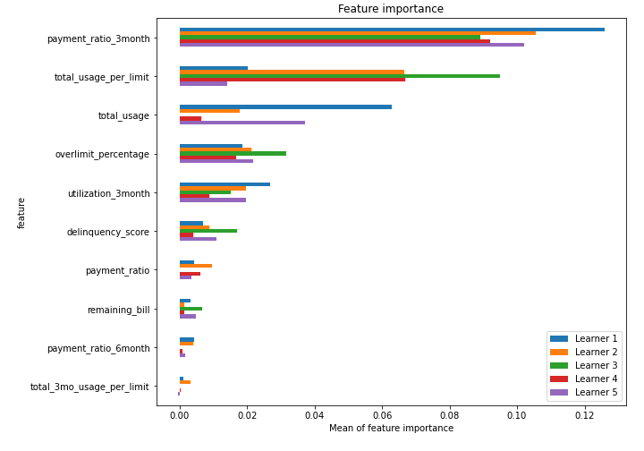
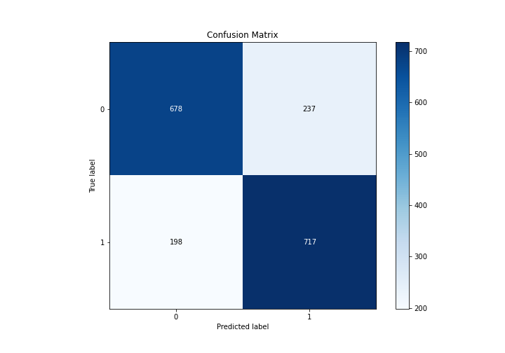
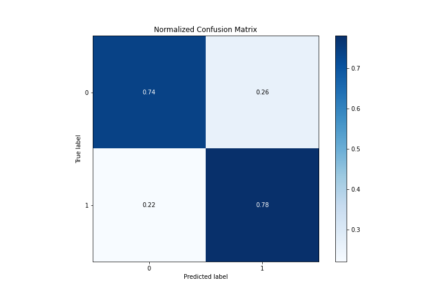
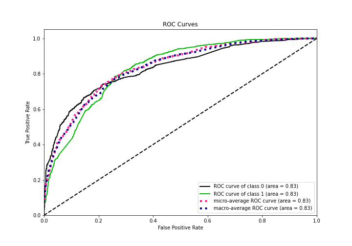
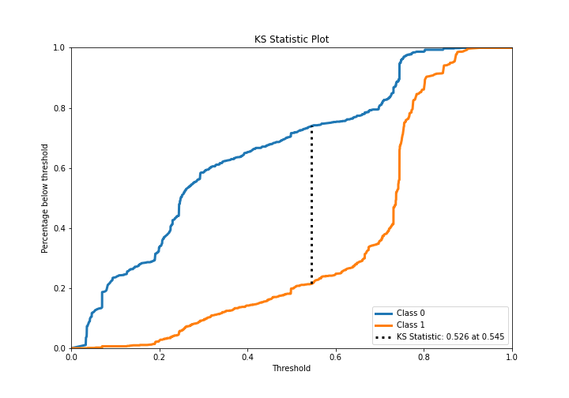
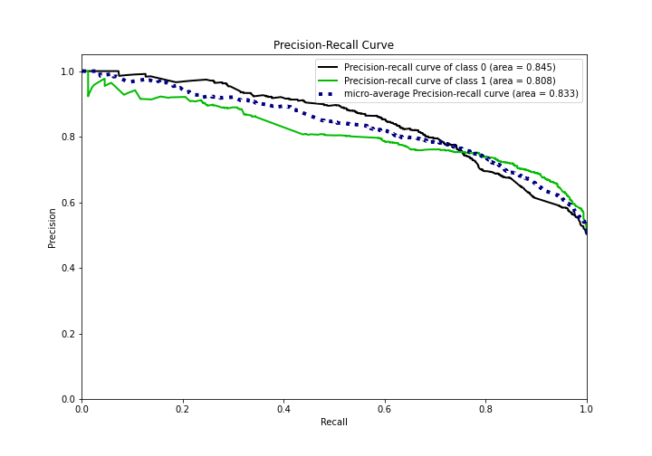
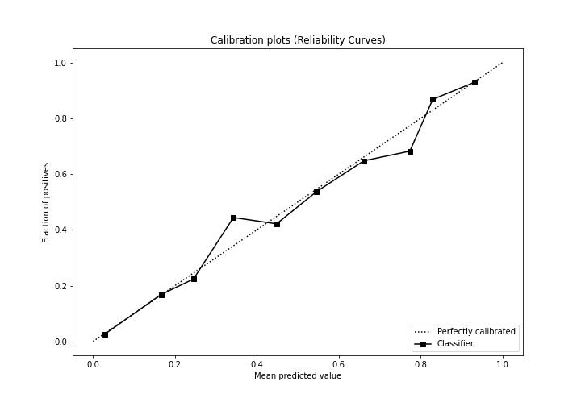
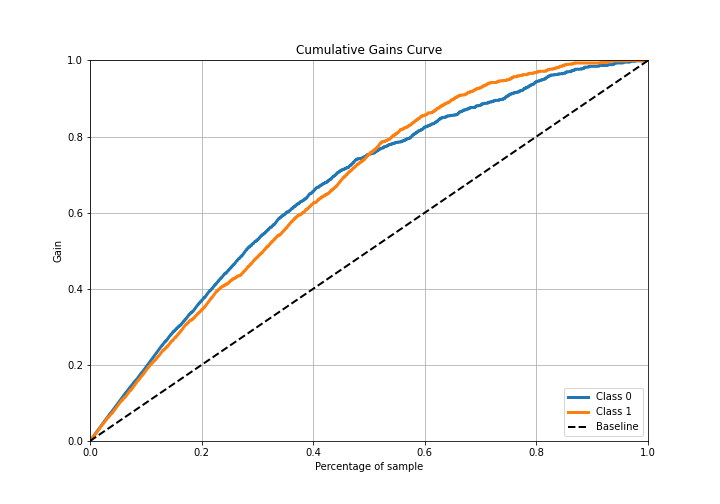
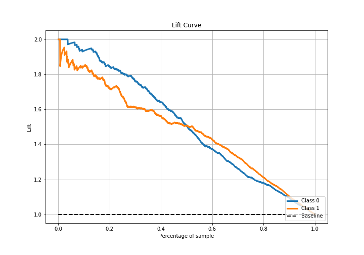

# Summary of 13_RandomForest

[<< Go back](../README.md)

## Random Forest
- **n_jobs**: -1
- **criterion**: entropy
- **max_features**: 1.0
- **min_samples_split**: 20
- **max_depth**: 3
- **eval_metric_name**: logloss
- **explain_level**: 1

## Validation
 - **validation_type**: kfold
 - **k_folds**: 5
 - **shuffle**: True
 - **stratify**: True

## Optimized metric
logloss

## Training time

17.7 seconds

## Metric details
|           |    score |   threshold |
|:----------|---------:|------------:|
| logloss   | 0.504447 | nan         |
| auc       | 0.83027  | nan         |
| f1        | 0.780465 |   0.309195  |
| accuracy  | 0.762295 |   0.548377  |
| precision | 0.941748 |   0.804861  |
| recall    | 1        |   0.0298235 |
| mcc       | 0.525067 |   0.548377  |

## Confusion matrix (at threshold=0.548377)
|              |   Predicted as 0 |   Predicted as 1 |
|:-------------|-----------------:|-----------------:|
| Labeled as 0 |              678 |              237 |
| Labeled as 1 |              198 |              717 |

## Learning curves

## Permutation-based Importance

## Confusion Matrix

## Normalized Confusion Matrix

## ROC Curve

## Kolmogorov-Smirnov Statistic

## Precision-Recall Curve

## Calibration Curve

## Cumulative Gains Curve

## Lift Curve

[<< Go back](../README.md)
