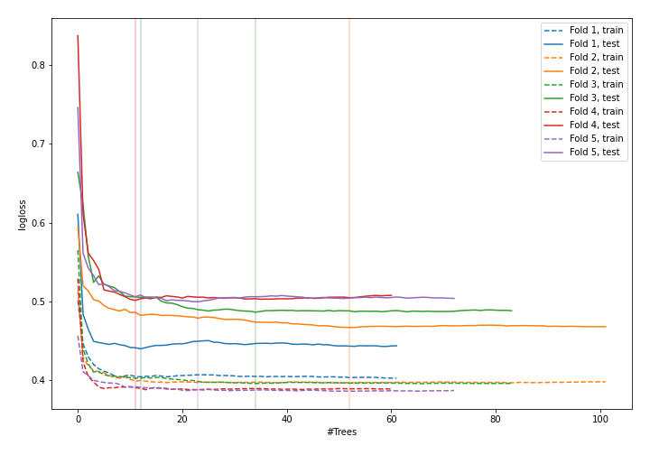
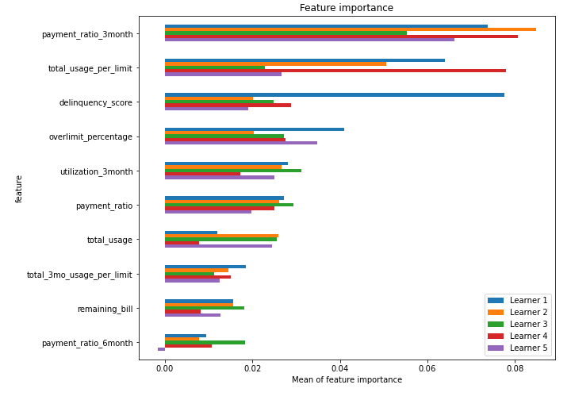
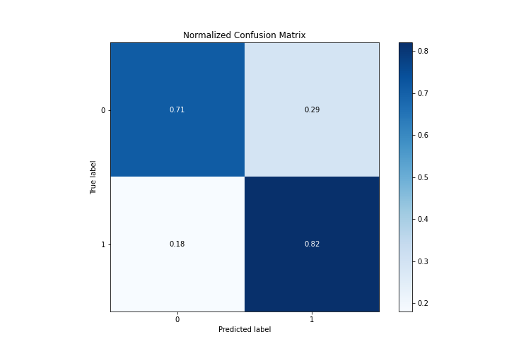
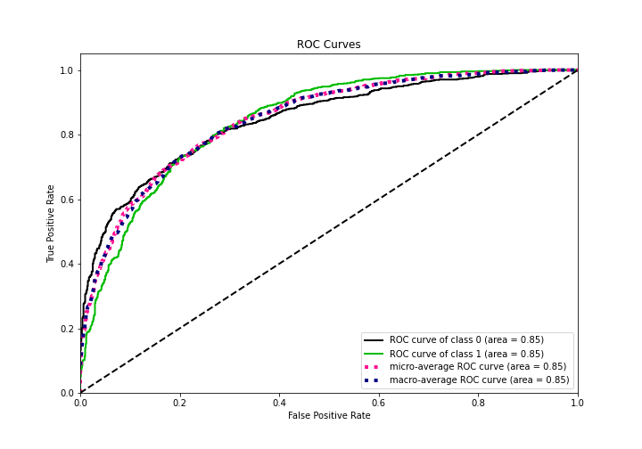
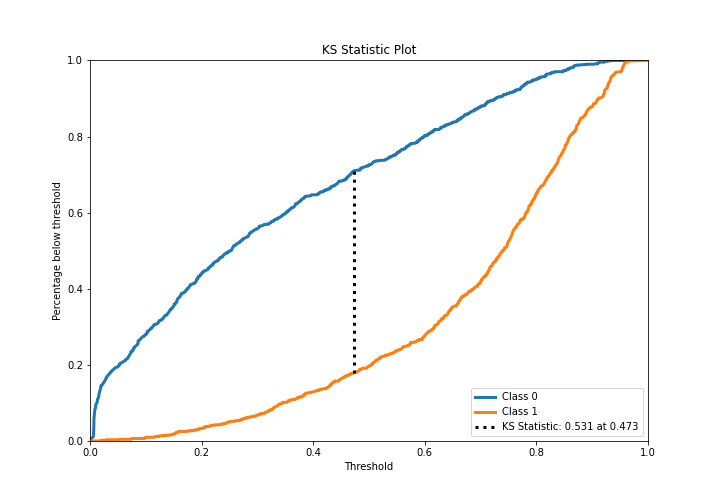
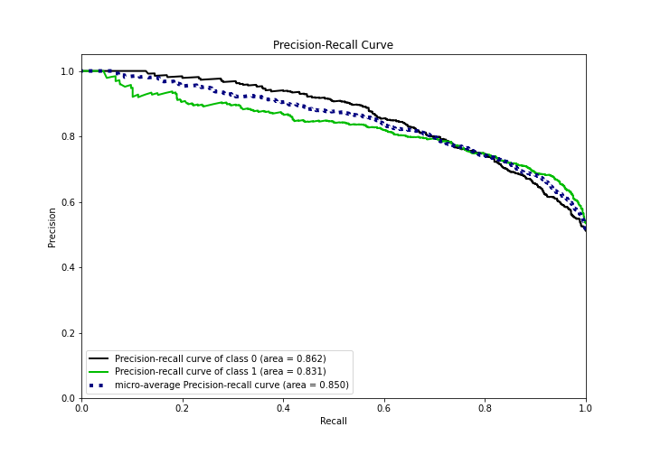
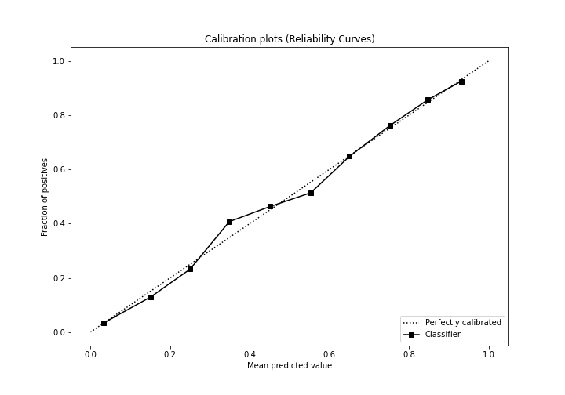
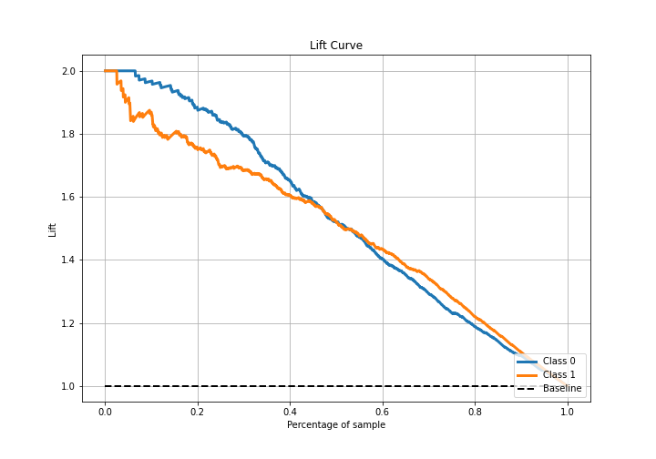

# Summary of 16_RandomForest

[<< Go back](../README.md)

## Random Forest
- **n_jobs**: -1
- **criterion**: gini
- **max_features**: 0.8
- **min_samples_split**: 50
- **max_depth**: 7
- **eval_metric_name**: logloss
- **explain_level**: 1

## Validation
 - **validation_type**: kfold
 - **k_folds**: 5
 - **shuffle**: True
 - **stratify**: True

## Optimized metric
logloss

## Training time

16.9 seconds

## Metric details
|           |    score |    threshold |
|:----------|---------:|-------------:|
| logloss   | 0.478849 | nan          |
| auc       | 0.846858 | nan          |
| f1        | 0.786506 |   0.304496   |
| accuracy  | 0.765574 |   0.473887   |
| precision | 0.959459 |   0.92248    |
| recall    | 1        |   0.00263727 |
| mcc       | 0.535418 |   0.38253    |

## Confusion matrix (at threshold=0.473887)
|              |   Predicted as 0 |   Predicted as 1 |
|:-------------|-----------------:|-----------------:|
| Labeled as 0 |              650 |              265 |
| Labeled as 1 |              164 |              751 |

## Learning curves

## Permutation-based Importance

## Confusion Matrix

## Normalized Confusion Matrix

## ROC Curve

## Kolmogorov-Smirnov Statistic

## Precision-Recall Curve

## Calibration Curve

## Cumulative Gains Curve

## Lift Curve

[<< Go back](../README.md)
