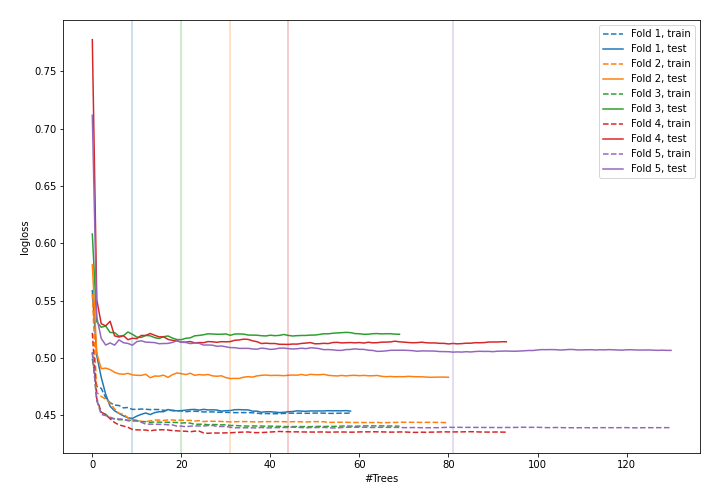
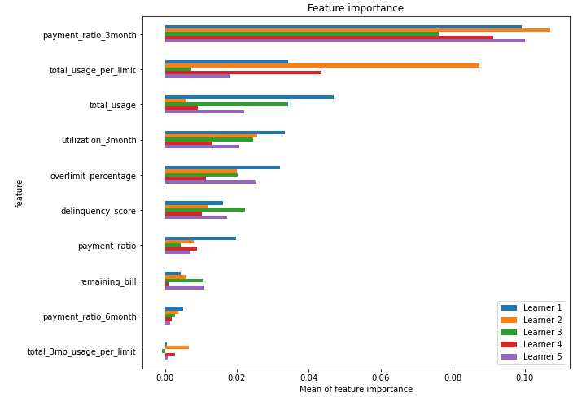
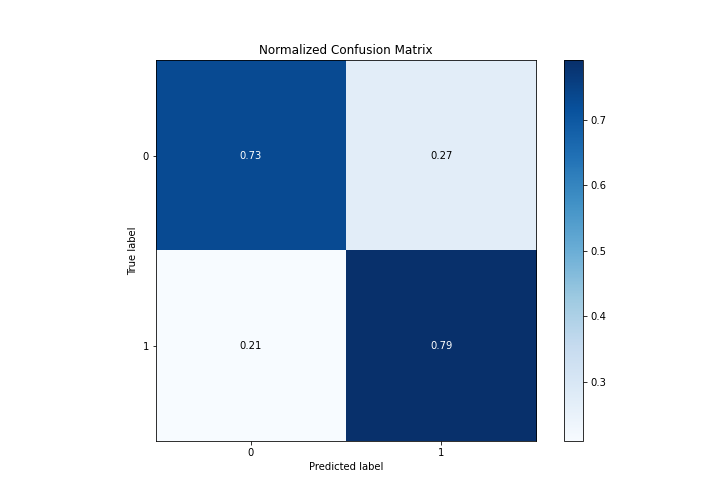
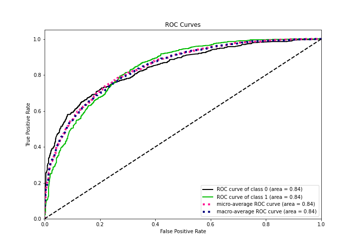
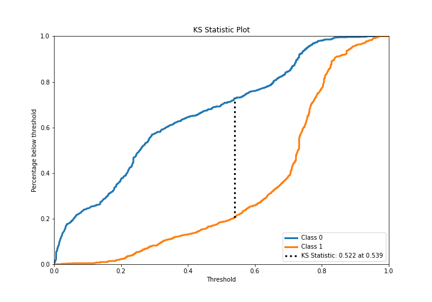
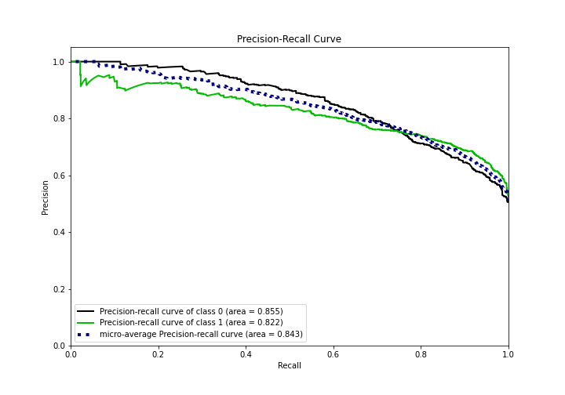
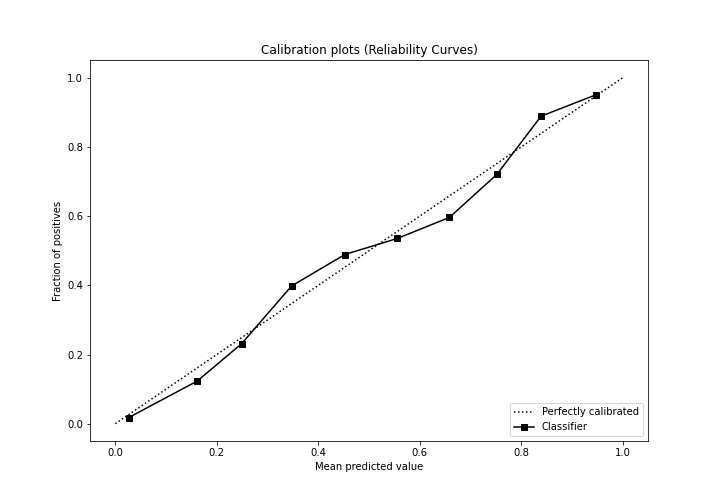
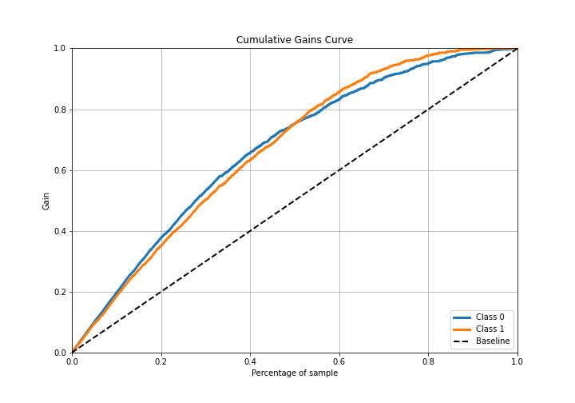
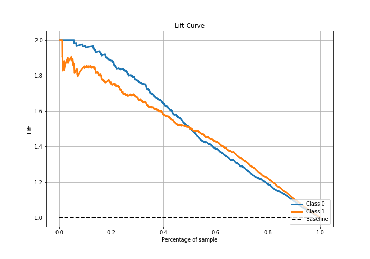

# Summary of 23_RandomForest

[<< Go back](../README.md)

## Random Forest
- **n_jobs**: -1
- **criterion**: entropy
- **max_features**: 0.9
- **min_samples_split**: 30
- **max_depth**: 4
- **eval_metric_name**: logloss
- **explain_level**: 1

## Validation
 - **validation_type**: kfold
 - **k_folds**: 5
 - **shuffle**: True
 - **stratify**: True

## Optimized metric
logloss

## Training time

16.0 seconds

## Metric details
|           |    score |    threshold |
|:----------|---------:|-------------:|
| logloss   | 0.492364 | nan          |
| auc       | 0.839283 | nan          |
| f1        | 0.783948 |   0.305427   |
| accuracy  | 0.760656 |   0.540885   |
| precision | 0.94382  |   0.84216    |
| recall    | 1        |   0.00558518 |
| mcc       | 0.528235 |   0.411889   |

## Confusion matrix (at threshold=0.540885)
|              |   Predicted as 0 |   Predicted as 1 |
|:-------------|-----------------:|-----------------:|
| Labeled as 0 |              666 |              249 |
| Labeled as 1 |              189 |              726 |

## Learning curves

## Permutation-based Importance

## Confusion Matrix

## Normalized Confusion Matrix

## ROC Curve

## Kolmogorov-Smirnov Statistic

## Precision-Recall Curve

## Calibration Curve

## Cumulative Gains Curve

## Lift Curve

[<< Go back](../README.md)
