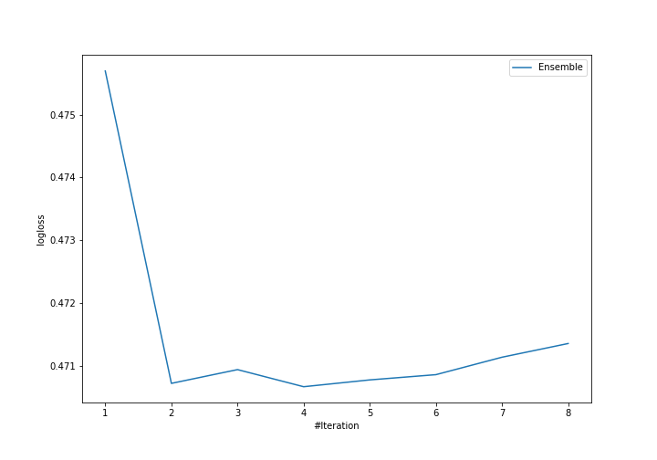
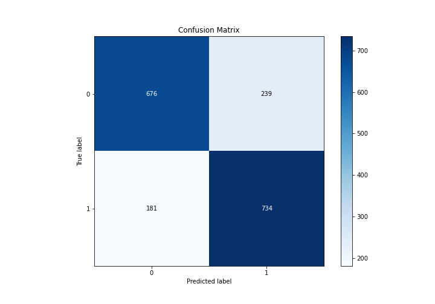
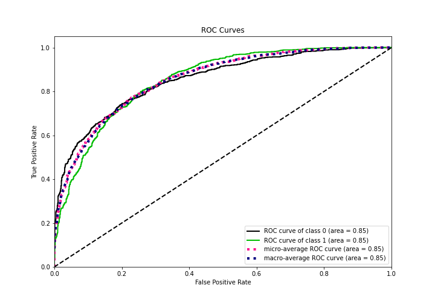
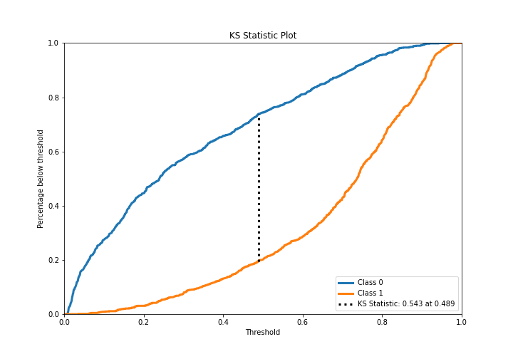
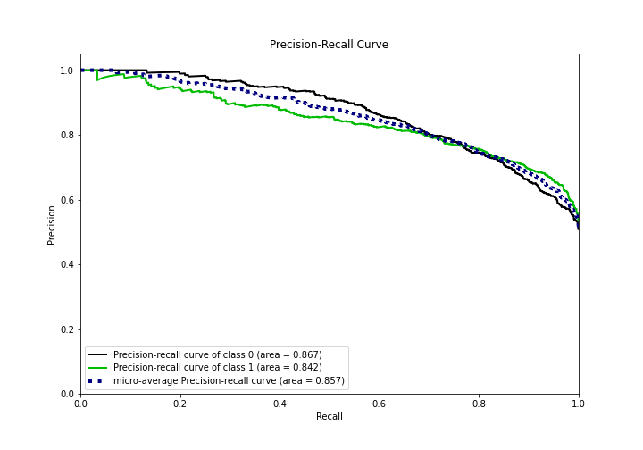
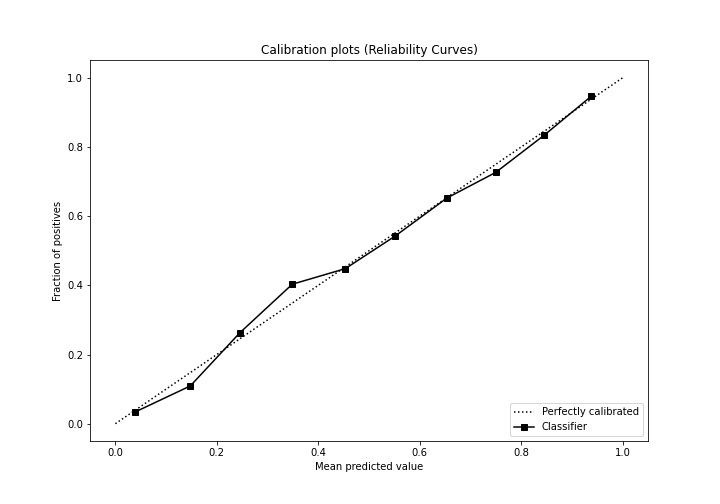
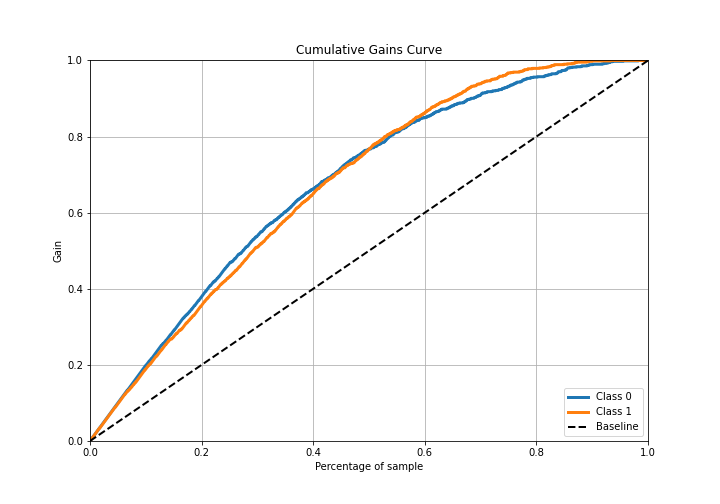
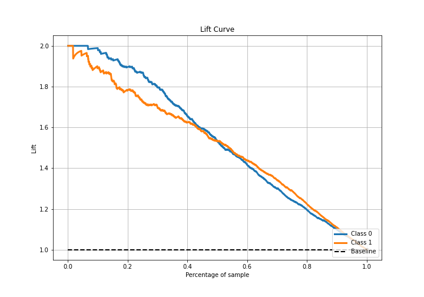

# Summary of Ensemble

[<< Go back](../README.md)

## Ensemble structure
| Model           |   Weight |
|:----------------|---------:|
| 12_RandomForest |        1 |
| 16_RandomForest |        1 |
| 25_Xgboost      |        1 |
| 26_Xgboost      |        1 |

## Metric details
|           |    score |    threshold |
|:----------|---------:|-------------:|
| logloss   | 0.470663 | nan          |
| auc       | 0.853134 | nan          |
| f1        | 0.78835  |   0.368494   |
| accuracy  | 0.770492 |   0.491177   |
| precision | 0.987179 |   0.920721   |
| recall    | 1        |   0.00724617 |
| mcc       | 0.542074 |   0.491177   |

## Confusion matrix (at threshold=0.491177)
|              |   Predicted as 0 |   Predicted as 1 |
|:-------------|-----------------:|-----------------:|
| Labeled as 0 |              676 |              239 |
| Labeled as 1 |              181 |              734 |

## Learning curves

## Confusion Matrix

## Normalized Confusion Matrix

## ROC Curve

## Kolmogorov-Smirnov Statistic

## Precision-Recall Curve

## Calibration Curve

## Cumulative Gains Curve

## Lift Curve

[<< Go back](../README.md)
