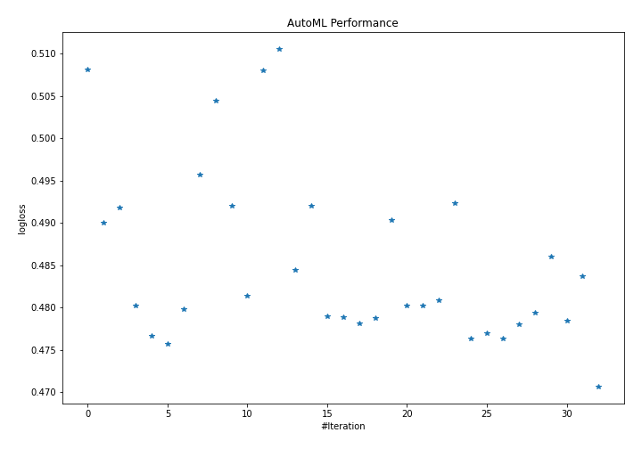
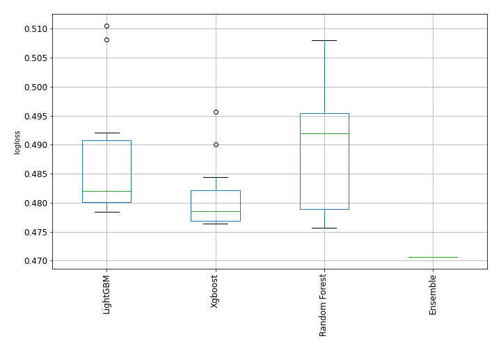
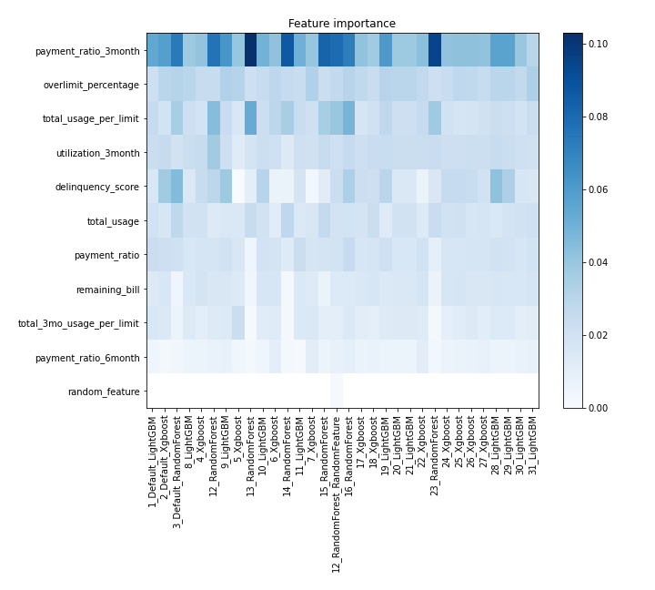
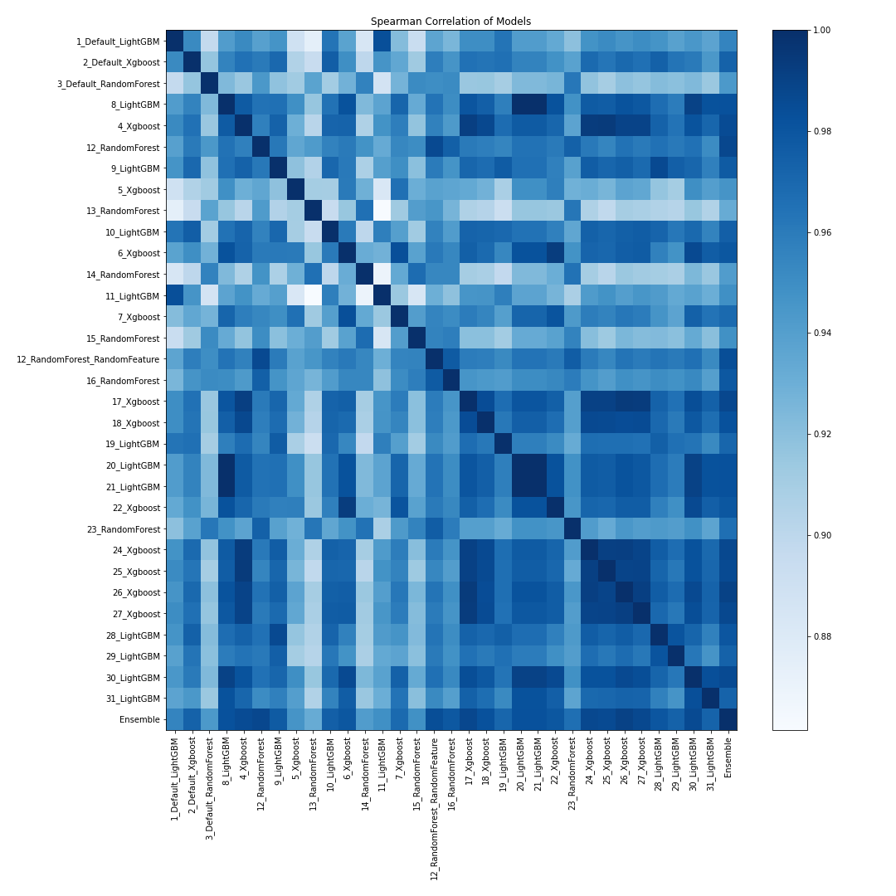

# AutoML Leaderboard

| Best model   | name                                                                     | model_type    | metric_type   |   metric_value |   train_time |   single_prediction_time |
|:-------------|:-------------------------------------------------------------------------|:--------------|:--------------|---------------:|-------------:|-------------------------:|
|              | [1_Default_LightGBM](1_Default_LightGBM/README.md)                       | LightGBM      | logloss       |       0.508137 |        13.23 |                   0.0796 |
|              | [2_Default_Xgboost](2_Default_Xgboost/README.md)                         | Xgboost       | logloss       |       0.490055 |        12.62 |                   0.0729 |
|              | [3_Default_RandomForest](3_Default_RandomForest/README.md)               | Random Forest | logloss       |       0.491796 |        17.63 |                   0.1119 |
|              | [8_LightGBM](8_LightGBM/README.md)                                       | LightGBM      | logloss       |       0.48027  |         9.52 |                   0.0658 |
|              | [4_Xgboost](4_Xgboost/README.md)                                         | Xgboost       | logloss       |       0.476665 |        11.62 |                   0.065  |
|              | [12_RandomForest](12_RandomForest/README.md)                             | Random Forest | logloss       |       0.475697 |        23.34 |                   0.145  |
|              | [9_LightGBM](9_LightGBM/README.md)                                       | LightGBM      | logloss       |       0.479837 |         9.39 |                   0.0607 |
|              | [5_Xgboost](5_Xgboost/README.md)                                         | Xgboost       | logloss       |       0.495671 |        12.75 |                   0.1229 |
|              | [13_RandomForest](13_RandomForest/README.md)                             | Random Forest | logloss       |       0.504447 |        20.24 |                   0.1196 |
|              | [10_LightGBM](10_LightGBM/README.md)                                     | LightGBM      | logloss       |       0.492031 |        11.05 |                   0.0648 |
|              | [6_Xgboost](6_Xgboost/README.md)                                         | Xgboost       | logloss       |       0.48139  |        13.18 |                   0.07   |
|              | [14_RandomForest](14_RandomForest/README.md)                             | Random Forest | logloss       |       0.508036 |        28.63 |                   0.1872 |
|              | [11_LightGBM](11_LightGBM/README.md)                                     | LightGBM      | logloss       |       0.510569 |        16.85 |                   0.0673 |
|              | [7_Xgboost](7_Xgboost/README.md)                                         | Xgboost       | logloss       |       0.484476 |        14.62 |                   0.0702 |
|              | [15_RandomForest](15_RandomForest/README.md)                             | Random Forest | logloss       |       0.492022 |        17.37 |                   0.0913 |
|              | [12_RandomForest_RandomFeature](12_RandomForest_RandomFeature/README.md) | Random Forest | logloss       |       0.479    |        21.57 |                   0.1858 |
|              | [16_RandomForest](16_RandomForest/README.md)                             | Random Forest | logloss       |       0.478849 |        19.05 |                   0.0918 |
|              | [17_Xgboost](17_Xgboost/README.md)                                       | Xgboost       | logloss       |       0.478176 |        13.6  |                   0.0614 |
|              | [18_Xgboost](18_Xgboost/README.md)                                       | Xgboost       | logloss       |       0.478803 |        11.8  |                   0.0721 |
|              | [19_LightGBM](19_LightGBM/README.md)                                     | LightGBM      | logloss       |       0.49038  |        11.3  |                   0.065  |
|              | [20_LightGBM](20_LightGBM/README.md)                                     | LightGBM      | logloss       |       0.48027  |        11.44 |                   0.063  |
|              | [21_LightGBM](21_LightGBM/README.md)                                     | LightGBM      | logloss       |       0.48027  |        14.62 |                   0.0649 |
|              | [22_Xgboost](22_Xgboost/README.md)                                       | Xgboost       | logloss       |       0.480931 |        12.65 |                   0.0681 |
|              | [23_RandomForest](23_RandomForest/README.md)                             | Random Forest | logloss       |       0.492364 |        18.68 |                   0.1209 |
|              | [24_Xgboost](24_Xgboost/README.md)                                       | Xgboost       | logloss       |       0.47634  |        12.49 |                   0.0641 |
|              | [25_Xgboost](25_Xgboost/README.md)                                       | Xgboost       | logloss       |       0.476992 |        13.54 |                   0.0618 |
|              | [26_Xgboost](26_Xgboost/README.md)                                       | Xgboost       | logloss       |       0.476355 |        13.54 |                   0.0739 |
|              | [27_Xgboost](27_Xgboost/README.md)                                       | Xgboost       | logloss       |       0.478084 |        13.44 |                   0.0698 |
|              | [28_LightGBM](28_LightGBM/README.md)                                     | LightGBM      | logloss       |       0.479442 |        12.32 |                   0.0662 |
|              | [29_LightGBM](29_LightGBM/README.md)                                     | LightGBM      | logloss       |       0.486012 |        11.5  |                   0.0634 |
|              | [30_LightGBM](30_LightGBM/README.md)                                     | LightGBM      | logloss       |       0.478471 |        12.45 |                   0.0661 |
|              | [31_LightGBM](31_LightGBM/README.md)                                     | LightGBM      | logloss       |       0.483768 |        16.85 |                   0.0649 |
| **the best** | [Ensemble](Ensemble/README.md)                                           | Ensemble      | logloss       |       0.470663 |         2.33 |                   0.4231 |

### AutoML Performance

### AutoML Performance Boxplot

### Features Importance

### Spearman Correlation of Models

